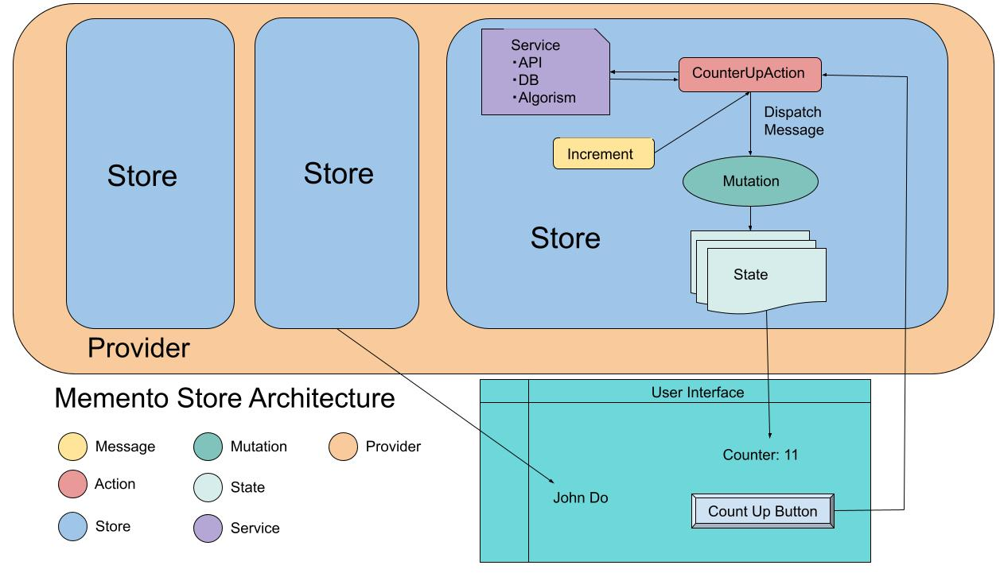

# Memento

[](https://opensource.org/licenses/MIT)

Flexible and easy unidirectional store-pattern container for state management with Dependency Injection for Frontend app on .NET or JS/TS.

[DEMO](https://le-nn.github.io/memento/) with React in Typescript

# Basic Concept

You can define stores inspired by MVU patterns such as Flux and Elm to observe state changes more detail.

Some are inspired by Elm and MVU.
And Redux and Flux pattern are same too, but memento is not Redux and Flux.

#### Features

* Less boilarplate and simple usage 
* Is not flux or redux
* Observe detailed status with command patterns and makes it easier to monitor what happened within the application 
* Immutable and Unidirectional data flow
* Multiple stores but manged by single provider, so can observe and manage as one state tree
* Less rules have been established
* Fragile because there are fewer established rules than Redux and Flux

# Concepts and Data Flow

Note the concept is a bit different from Flux and Redux



## Rules

* State should always be read-only.
* To mutate state our app should mutate via Reducer in the action method
* Every Reducer that processes in the action will create new state to reflect the old state combined with the changes expected for the action.
* The UI then uses the new state to render its display.

## Overview

This is an C# example implements counter.

Store 
```csharp
using Memento.Core;
using System.Collections.Immutable;
using static Blazor.Sample.Stores.AsyncCounterCommands;

namespace Blazor.Sample.Stores;

public record AsyncCounterState {
    public int Count { get; init; } = 0;

    public bool IsLoading { get; init; } = false;

    public ImmutableArray<int> Histories { get; init; } = ImmutableArray.Create<int>();
}

public record AsyncCounterCommands: Command {
    public record CountUp : AsyncCounterCommands;
    public record Increment : AsyncCounterCommands;
    public record SetCount(int Count) : AsyncCounterCommands;
    public record BeginLoading : AsyncCounterCommands;
}

public class AsyncCounterStore : Store<AsyncCounterState, AsyncCounterCommands> {
    public AsyncCounterStore() : base(() => new(), Reducer) { }

    static AsyncCounterState Reducer(AsyncCounterState state, AsyncCounterCommands command) {
        return command switch {
            CountUp => state with {
                Count = state.Count + 1,
                IsLoading = false,
                Histories = state.Histories.Add(state.Count + 1),
            },
            SetCount payload => state with {
                Count = payload.Count,
            },
            Increment => state with {
                Count = state.Count + 1,
            },
            BeginLoading => state with {
                IsLoading = true,
            },
            _ => throw new CommandNotHandledException(command),
        };
    }

    public async Task CountUpAsync() {
        Mutate(new BeginLoading());
        await Task.Delay(800);
        Mutate(new CountUp());
    }

    public void CountUpManyTimes(int count) {
        for (int i = 0; i < count; i++) {
            Mutate(new Increment());
        }
    }

    public void SetCount(int c) {
        Mutate(new SetCount(c));
    }
}

```

Razor view
```razor
@using Blazor.Sample.Stores
@using System.Text.Json

@page "/counter"
@inherits ObserverComponet
@inject AsyncCounterStore AsyncCounterStore

<PageTitle>Counter</PageTitle>
<h1>Async Counter</h1>
<p role="status">Current count: @AsyncCounterStore.State.Count</p>
<p role="status">Loading: @AsyncCounterStore.State.IsLoading</p>
<p role="status" class="mb-0">History</p>
<div class="d-flex">
    [
    @foreach (var item in string.Join(", ", AsyncCounterStore.State.Histories)) {
        @item
    }
    ]
</div>
<button class="mt-3 btn btn-primary" @onclick="IncrementCount">Count up</button>
<button class="mt-3 btn btn-primary" @onclick="CountupMany">Count up 10000 times</button>

@code {
    async Task IncrementCount() {
        await this.AsyncCounterStore.CountUpAsync();
    }

    void CountupMany() {
        this.AsyncCounterStore.CountUpManyTimes(10000);
    }
}

```

## Compatibility and bindings

### The currently supported framework bindings are as follows

| Lang    | Framework                   |
| ------- | --------------------------- |
| TS/JS   | React                       |
| C#      | Blazor                      |

### Current packages and status

| Package Name    | Version | Lang       | Platform            | Package manager | Release Notes                      | Package provider                                       |
| --------------- | ------- | ---------- | ------------------- | --------------- | ---------------------------------- | ------------------------------------------------------ |
| memento.core    | 1.0.3   | TS/JS      | node.js 14 or later | npm or yarn     | [Notes](./release-notes.node.md)   | [npm](https://www.npmjs.com/package/memento.core)      |
| memento.react   | 1.0.4   | TS/JS      | node.js 14 or later | npm or yarn     | [Notes](./release-notes.node.md)   | [npm](https://www.npmjs.com/package/memento.react)     |
| Memento.Core    | 0.2.0   | C#         | .NET 6 or later     | Nuget           | [Notes](./release-notes.dotnet.md) | [Nuget](https://www.nuget.org/packages/Memento.Core)   |
| Memento.Blazor  | 0.2.0   | Blazor     | .NET 6 or later     | Nuget           | [Notes](./release-notes.dotnet.md) | [Nuget](https://www.nuget.org/packages/Memento.Blazor) |

# Documentation

[Basic Concept with Typescript/Javascript](./docs/Tutorial.ts.md)

[Basic Concept with C#](./docs/Tutorial.cs.md)

[React](./docs/React/GettingStandard.md)

[Blazor](./docs/Blazor/GettingStandard.md)

# Demo

Here is a demo site built with React in Typescript.
[DEMO](https://le-nn.github.io/memento/)


# License
Designed with ♥ by le-nn. Licensed under the MIT License.
