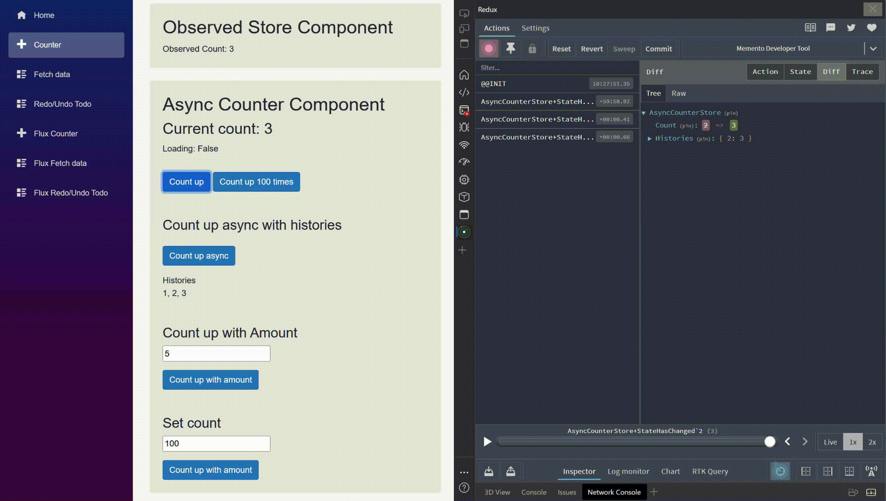

# Memento

[](https://opensource.org/licenses/MIT)

Easy unidirectional store and redo/undo library for state management for frontend apps on Blazor/.NET



### 日本語

[使い方と紹介](https://zenn.dev/remrem/articles/32ee38e79f4cf0)

[Redux DevToolsについて](https://zenn.dev/remrem/articles/0768982b3cdc92)

# Basic Concept

We provides a Store that allows you to share state between components.
All stores are managed by a single provider and can subscribe to state change notifications.
Undirectional flow and immutable change of state provides a predictable architecture.
In addition, we provide a store that easily implements Redo/Undo by managing in immutable states.

### For patterns like Flux or MVU

Besides simple store pattern, we also provide patterns inspired by MVU patterns such as Flux and Elm.
Since you should change the state via the Reducer, you can change the state based on stricter rules and observe the state in detail.

### ReduxDevTools

[Redux DevTools](https://github.com/reduxjs/redux-devtools) is supported.
Redux DevTools is a tool for debugging application's state changes.
State can be time traveled and history can be viewed in DevTools.

[See docs](./docs/ReduxDevTools.md) for details of usage.

## DEMO Page

https://le-nn.github.io/memento/

If you have ReduxDevTool installed,
DevTool will launch automatically.
You can do state history and time travel.

## React or TS/JS bindings

Currently, moved to here
https://github.com/le-nn/memento-js

## Features

* Less boilerplate, less rule and simple usage 
* Immutable state and Unidirectional flow
* Multiple stores but managed by single provider, so can observe and manage as one state tree
* Observe detailed status with command patterns and makes it easier to monitor what happened within the application 

## Concepts and Flow


## Rules

* State should always be read-only.
* The UI then uses the new state to render its display.

### For patterns like Flux
* Every Reducer that processes in the action will create new state to reflect the old state combined with the changes expected for the action.
* To change state our app should Dispatch via Reducer in the action method

## Store Overview

This is an C# and Blazor example that implements counter.

Simple Store Pattern

```csharp
using Memento.Core;
using System.Collections.Immutable;

namespace Memento.Sample.Blazor;

public record AsyncCounterState {
    public int Count { get; init; } = 0;

    public bool IsLoading { get; init; } = false;

    public ImmutableArray<int> Histories { get; init; } = ImmutableArray.Create<int>();
}

public class AsyncCounterStore : Store<AsyncCounterStore> {
    public AsyncCounterStore() : base(() => new()) { }

    public async Task CountUpAsync() {
        Mutate(state => state with { IsLoading = true, });
        await Task.Delay(800);
        Mutate(state => state with {
            IsLoading = false,
            Count = state.Count + 1,
            Histories = state.Histories.Add(state.Count + 1),        
        });
    }
}

```

Flux Store Pattern
```csharp
using Memento.Core;
using System.Collections.Immutable;
using static Memento.Sample.Blazor.Stores.AsyncCounterCommands;

namespace Memento.Sample.Blazor;

public record AsyncCounterState {
    public int Count { get; init; } = 0;

    public bool IsLoading { get; init; } = false;

    public ImmutableArray<int> Histories { get; init; } = ImmutableArray.Create<int>();
}

public record AsyncCounterCommands: Command {
    public record Increment : AsyncCounterCommands;
    public record SetCount(int Count) : AsyncCounterCommands;
    public record BeginLoading : AsyncCounterCommands;
}

public class AsyncCounterStore : FluxStore<AsyncCounterState, AsyncCounterCommands> {
    public AsyncCounterStore() : base(() => new(), Reducer) { }

    static AsyncCounterState Reducer(AsyncCounterState state, AsyncCounterCommands command) {
        return command switch {
            CountUp => state with {
                Count = state.Count + 1,
                IsLoading = false,
                Histories = state.Histories.Add(state.Count + 1),
            },
            BeginLoading => state with {
                IsLoading = true,
            },
            _ => throw new CommandNotHandledException(command),
        };
    }

    public async Task CountUpAsync() {
        Dispatch(new BeginLoading());
        await Task.Delay(800);
        Dispatch(new CountUp());
    }
}

```

Blazor view in Razor
```razor
@page "/counter"
@inherits ObserverComponet
@inject AsyncCounterStore AsyncCounterStore

<PageTitle>Counter</PageTitle>
<h1>Async Counter</h1>
<p role="status">Current count: @AsyncCounterStore.State.Count</p>
<p role="status">Loading: @AsyncCounterStore.State.IsLoading</p>
<p role="status" class="mb-0">History</p>
<div class="d-flex">
    [
    @foreach (var item in string.Join(", ", AsyncCounterStore.State.Histories)) {
        @item
    }
    ]
</div>
<button class="mt-3 btn btn-primary" @onclick="IncrementCount">Count up</button>

@code {
    async Task IncrementCount() {
        await AsyncCounterStore.CountUpAsync();
    }
}

```

# Documentation

[See](./docs/README.md)

# License

Designed with ♥ by le-nn. Licensed under the MIT License.
