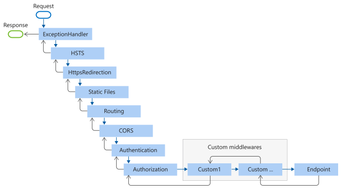

# What is Middleware

Middleware can be implemented to interrupt the process when updating the state.
Middleware can be extended for various purposes, such as implementing your own Logger or supporting ReduxDevTools.

## Middleware pipeline

Middleware is a component built into the StoreProvider and Store pipeline to interrupt another function in the state change process.

A ```StoreProvider``` can have multiple middlewares registered.
The middleware is interrupted by state changes like a chain and is connected to the chain . The middleware is connected like a chain.

Each delegate can perform operations before and after the next delegate.


### How to actually interrupt the State Changes

Suppose Middleware is registered with the service as follows

```cs
services.AddMiddleware(() => new Middleware1());
services.AddMiddleware(() => new Middleware2());
services.AddMiddleware(() => new Middleware3());
```

Pipelines are built in the order in which they are registered



The specific code looks like this

The ```NextProviderMiddlewareCallback``` argument is a delegate handler that calls the next middleware to be connected.

If the state is not changed, handle the next middleware and return the result.
```return next(state, e);```

If you return null in middleware handler, the state change is canceled and no state change event is fired.

```return null;```

```cs
// Middleware1
public override RootState? HandleProviderDispatch(RootState? state, StateChangedEventArgs e, NextProviderMiddlewareCallback next) {
    // pre logic
    var handledState =  next(state, e); // Handle Middleware2
    // post logic

    return handledState; // The state changes will be canceled if handleState is null
}

// Middleware2
public override RootState? HandleProviderDispatch(RootState? state, StateChangedEventArgs e, NextProviderMiddlewareCallback next) {
    // pre logic
    var handledState =  next(state, e); // Handle Middleware3
    // post logic

    return handledState;
}

// Middleware3
public override RootState? HandleProviderDispatch(RootState? state, StateChangedEventArgs e, NextProviderMiddlewareCallback next) {
    // pre logic
    var handledState =  next(state, e); // Handle Middleware4
    // post logic

    return handledState;
}

// ...

```

They are based on the Middleware pattern and
They function like ASP.NET Core Middleware.

https://learn.microsoft.com/en-us/aspnet/core/fundamentals/middleware/?view=aspnetcore-7.0

## Implements Middleware and MiddlewareHandler

Let's look at a more concrete implementation

Implement your own Middleware by inheriting from ```Middleware``` abstract class.
The ```Middleware``` abstract class can only inherit from
Create a ```MiddlewareHandler``` by simply overriding ```MiddlewareHandler Create(IServiceProvider provider)``` .
The actual functionality and implementation is delegated to ```MiddlewareHandler```.
To interrupt state updates, override ```HandleProviderDispatch()``` or ```HandleStoreDispatch``` .

```HandleProviderDispatch(...)``` overrides ```StoreProviderDispatch()``` when ```StoreProvider``` detects a state update.
```StoreProvider``` handles when it detects a state update, that is, when the state of one of the application's Stores changes.

```HandleStoreDispatch(...)``` handles only the Store whose state has been updated.

The following example overrides ```HandleProviderDispatch(...)``` overrides ```StoreProvider``` and interrupts the state change with ```StoreProvider``` . The log is handled when the state of any Store is changed.

The argument RootState is an ```IDictionary<TKey, TValue>``` that represents all StateTrees managed by ```StoreProvider``` .

The ```next``` of ```NextProviderMiddlewareCallback``` argument is a delegate handler that calls the next connected middleware.

If you don't want to change state, process the next middleware and return the result.
```return next(state, e);```

If you return null, the state change is canceled and no state change event is fired.
```return null;``` However, if you return null, the connection is still active.

However, even if you return null, it is possible that some state may be returned by the previous middleware that is connected to it.

```LoggerMiddlewareHandler.HandleProviderDispatch(...)``` implements only ```return next(state, e);``` by default.

The ```HandleStoreDispatch``` does the same.
However, if the ```object``` to be returned does not match the type of State managed by the Store, an exception will be thrown.

### LoggerMiddleware

This is an example of LoggerMiddleware.
It handles StoreProvider and outputs a log of all state changes to the console.

```cs

/// <summary>
/// Middleware for logging state changes.
/// </summary>
public sealed class LoggerMiddleware : Middleware {
    /// <summary>
    /// Creates a new instance of the LoggerMiddlewareHandler.
    /// </summary>
    /// <param name="provider">The service provider used to resolve required services.</param>
    /// <returns>A new LoggerMiddlewareHandler instance.</returns>
    protected override MiddlewareHandler Create(IServiceProvider provider) {
        return new LoggerMiddlewareHandler(
            provider.GetRequiredService<IJSRuntime>()
        );
    }

    /// <summary>
    /// Handler for logging state changes in the LoggerMiddleware.
    /// </summary>
    public class LoggerMiddlewareHandler : MiddlewareHandler {
        private readonly IJSRuntime _jSRuntime;

        /// <summary>
        /// Creates a new instance of the LoggerMiddlewareHandler.
        /// </summary>
        /// <param name="jSRuntime">The JavaScript runtime to be used for logging.</param>
        public LoggerMiddlewareHandler(IJSRuntime jSRuntime) {
            _jSRuntime = jSRuntime;
        }

        /// <summary>
        /// Handles logging the state changes before passing them to the next middleware.
        /// </summary>
        /// <param name="state">The current state of the application.</param>
        /// <param name="e">The state change event arguments.</param>
        /// <param name="next">The next middleware in the pipeline.</param>
        /// <returns>The updated state after processing by the middleware pipeline.</returns>
        public override RootState? HandleProviderDispatch(RootState? state, StateChangedEventArgs e, NextProviderMiddlewareCallback next) {
            _ = HandleLog(state, e);
            return next(state, e);
        }

        /// <summary>
        /// Logs the state changes using the JavaScript console.
        /// </summary>
        /// <param name="state">The current state of the application.</param>
        /// <param name="e">The state change event arguments.</param>
        /// <returns>A task representing the logging operation.</returns>
        public async Task HandleLog(object? state, StateChangedEventArgs e) {
            if (state is null) {
                return;
            }

            await _jSRuntime.InvokeVoidAsync("console.log", new {
                StateName = state.GetType().Name,
                State = state,
                EventArgs = e,
            });
        }
    }
}

```

Register middleware instances to IServiceCollection in callback.

```cs
builder.Services.AddMiddleware(() => new LoggerMiddleware());
```

## DEMO

Here is sample code for this tutorial.

https://github.com/le-nn/memento/blob/main/samples/Memento.Sample.BlazorWasm/LoggerMiddleware.cs

or

https://github.com/le-nn/memento/blob/main/samples/Memento.Sample.BlazorServer/LoggerMiddleware.cs

The ``LoggerMiddleware`` is implemented in the Memento sample on the DEMO page and can be found in the console tab of Chrome's DevTool.

https://le-nn.github.io/memento/
